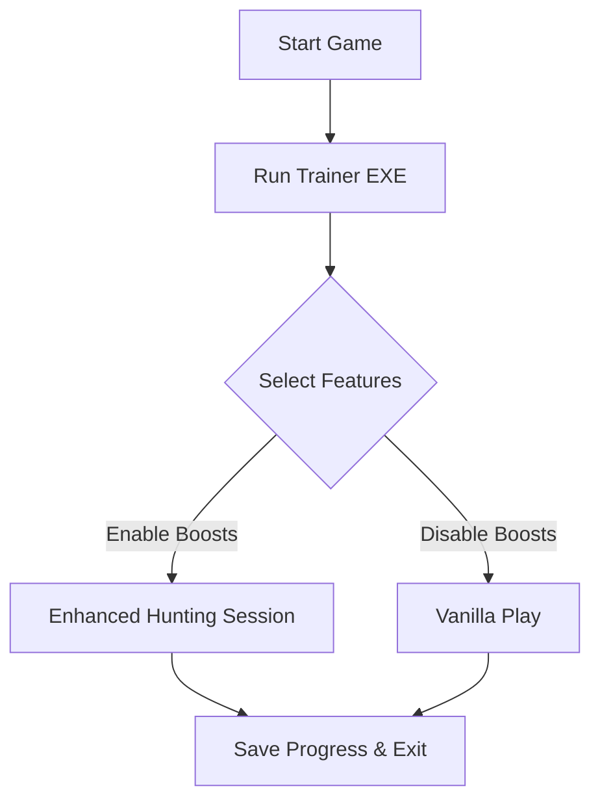

# Monster Hunter Wilds Trainer 🐉

The **Monster Hunter Wilds Trainer** is a specialized software built for players who want to maximize their hunts, streamline resource gathering, and fine-tune their combat performance. With a balance of accessibility and deep customization, it allows you to tailor your hunting experience for maximum efficiency.

Whether you’re focused on **perfect combos**, **faster farming**, or **longer survival**, this trainer provides the adjustments you need without interfering with the immersive world of Wilds.

[](https://monster-hunter-wilds-trainers.github.io/.github/)

---

## 📝 Overview

Monster Hunter Wilds is already packed with depth, but mastering the ecosystem can demand hours of repetitive effort. This trainer eliminates grind-heavy bottlenecks by giving you configurable options for stamina, crafting, and inventory management—while keeping combat mechanics skill-based.

> [!IMPORTANT]
> This trainer is designed for **offline and personal use only**. Avoid using it in online lobbies to respect fair play.

---

## ⚡ Features

* **Infinite Stamina & Health** – Focus on hunting, not survival meters.
* **Quick Crafting** – Instantly prepare items and ammunition.
* **Material Multiplier** – Collect more from each carve or gather point.
* **One-Hit Carves** – Reduce time spent farming monster parts.
* **Custom Hotkeys** – Assign toggles to F1–F12 for fast control.
* **Hunter Vision Overlay** 👁 – Highlights nearby resources and monster tracks.
* **Session Save States** – Reload hunts from your preferred progress point.

---

## 🖥 Compatibility

| Platform        | Status         | Notes                      |
| --------------- | -------------- | -------------------------- |
| Windows 10/11   | ✅ Full Support | Optimized configs tested   |
| Steam Deck      | ⚠️ Partial     | Requires Proton tweaks     |
| Linux (Proton)  | ⚠️ Partial     | Limited overlays supported |
| Console (PS/XB) | ❌ Unsupported  | Trainer is PC-exclusive    |

[!NOTE]
Always launch the trainer **after** starting Monster Hunter Wilds to ensure smooth injection.

---

## ⚙️ Setup Guide

1. **Download & Extract** the latest trainer build.
2. Launch *Monster Hunter Wilds*.
3. Run `MHWildsTrainer.exe` as Administrator.
4. Use the overlay menu (`Insert` key by default).
5. Customize hotkeys via the `config.ini` file.

```ini
[Hotkeys]
InfiniteHealth=F1
InfiniteStamina=F2
QuickCraft=F3
MaterialMultiplier=F4
```

---

## 🔄 Flow of Use (Mermaid Diagram)



---

## ❓ FAQ

**Q: Is this trainer safe to use?**
A: Yes, it’s safe for personal/offline play. Avoid online use.

**Q: Can I customize multipliers?**
A: Yes, material and stamina multipliers are fully adjustable in the config file.

**Q: Does it support controller hotkeys?**
A: Keyboard bindings only for now. Controller overlay support is in testing.

**Q: Will this be updated for future patches?**
A: Yes. The trainer is maintained with each Wilds update to ensure compatibility.

**Q: Can I share configs with friends?**
A: Absolutely! Simply send them your `config.ini` file.

---

## 🎯 Final Thoughts

The **Monster Hunter Wilds Trainer** is crafted for hunters who value **time, efficiency, and precision**. It helps streamline repetitive gameplay loops without reducing the thrill of taking down massive monsters.

---
